# Architecture

## Multi-Head Attention

在探索Q与K之间的依赖关系时，首先通过线性映射讲Q与K映射到同一个维度

然后分别进行分头操作，将Q、K的最后一个维度（特征维度）分成N分

对于N个头分别计算点积注意力权重

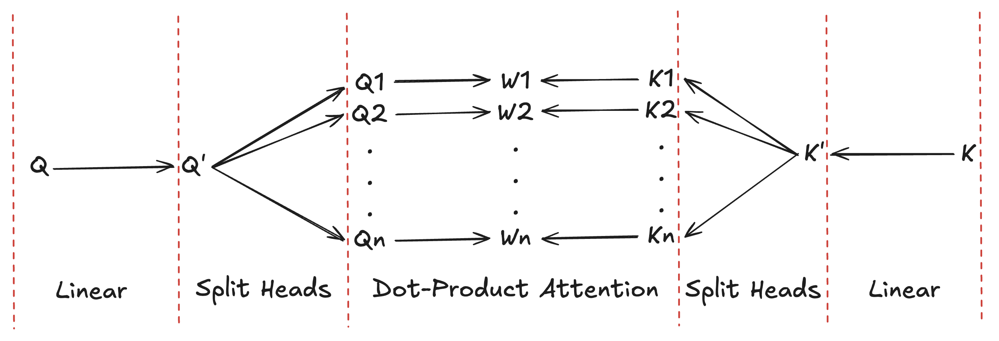

这里其实计算得到注意力分数的时候会进行一个缩放操作，目的是方式softmax过饱和

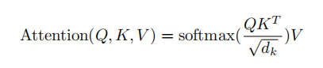

同理，在应用这些注意力权重时，也需要对V进行线性映射与分头操作

不同的头应用不同的注意力权重计算出各个注意力头的查询结果，然后将各个头的结果再拼接到一起得到输出

由于分头到这个机制，导致输出中各个头的维度信息是没有依赖关系的

所以通过最后一个不改变维度的线性层来融合各个维度的信息，得到最终的输出

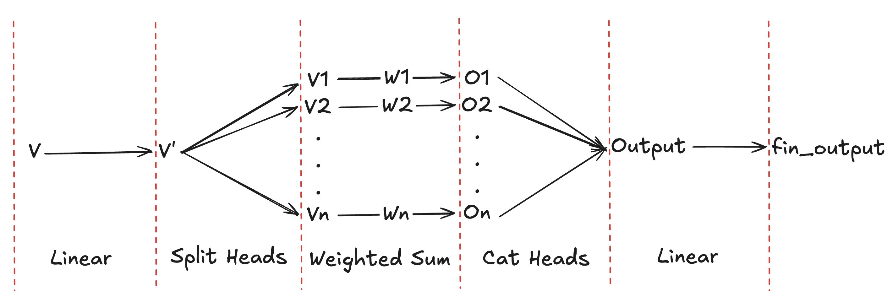

## Feed Forward

前馈网络层就是一个MLP

通过在中间层设置一个ReLU激活函数来提取特征维度数据之间的非线性关系

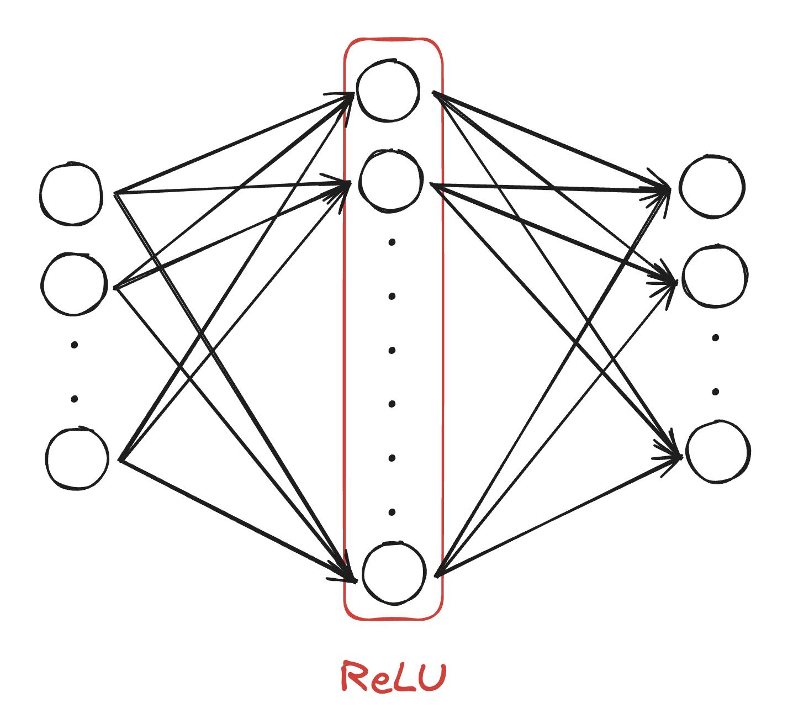

## Residual

通过残差连接的方式，让梯度的传递更加稳定，防止梯度消失

对于新计算得到的值施加一个dropout进行正则化，增强模型泛化能力

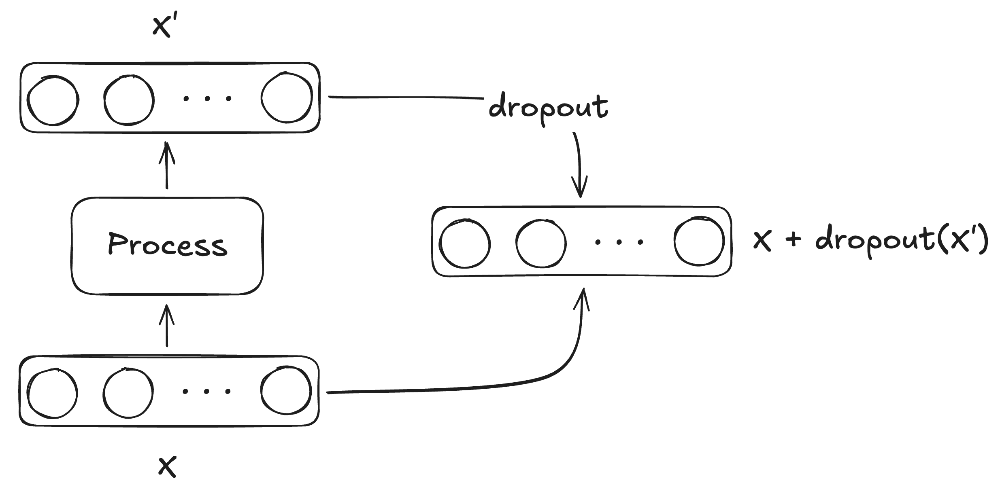

## Layer Normalization

对数据的最后一个维度（特征维度）进行归一化操作

具有可学习参数，作用是对原本对归一化的数值进行缩放与平移

归一化的作用是控制数值范围，防止梯度爆炸，让模型训练更加稳定

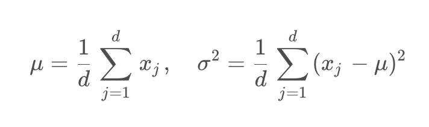

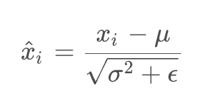

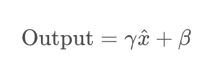

## Encoder Block

使用上面的子模块就可以构成一个编码器块：

- 第一层是多头注意力层（自注意力）
- 第二层是对输出进行残差连接与归一化操作
- 第三层是前馈网络层，提取特征维度数据之间的非线性依赖
- 第四层是对输出进行残差连接与归一化操作

通过叠加多层编码器块，可以得到最终的编码器

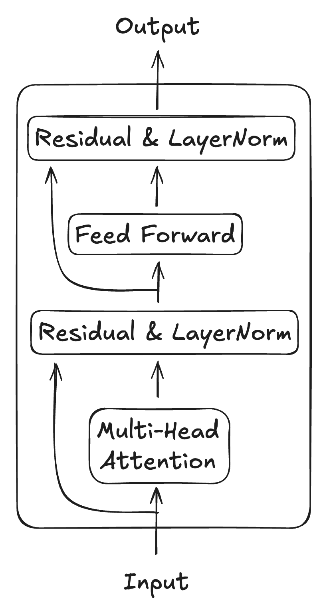

## Decoder Block

使用上面的子模块就可以构成一个解码器块：

- 第一层是多头注意力层（自注意力）
- 第二层是对输出进行残差连接与归一化操作
- 第三层是多头注意力层（交叉注意力，Q是解码器块的输入，KV对是整个编码器的输出）
- 第四层是对输出进行残差连接与归一化操作
- 第五层是前馈网络层，提取特征维度数据之间的非线性依赖
- 第六层是对输出进行残差连接与归一化操作

通过叠加多层解码器块，可以得到最终的解码器

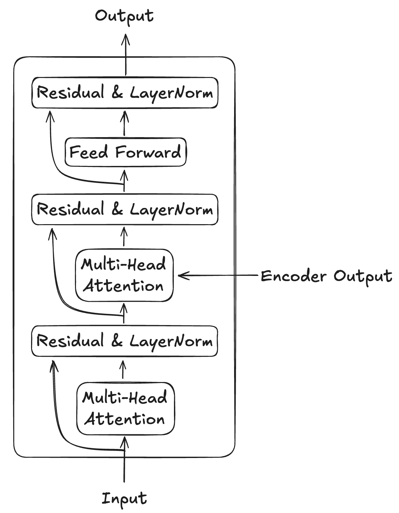

## Embedding

将离散的token id转为特征向量，本质是将one-hot和linear操作合并为一个查表操作，加快计算同时减少内存消耗

通过训练学习，可以让词汇拥有语义空间，语义相似的token对应的特征向量越靠近

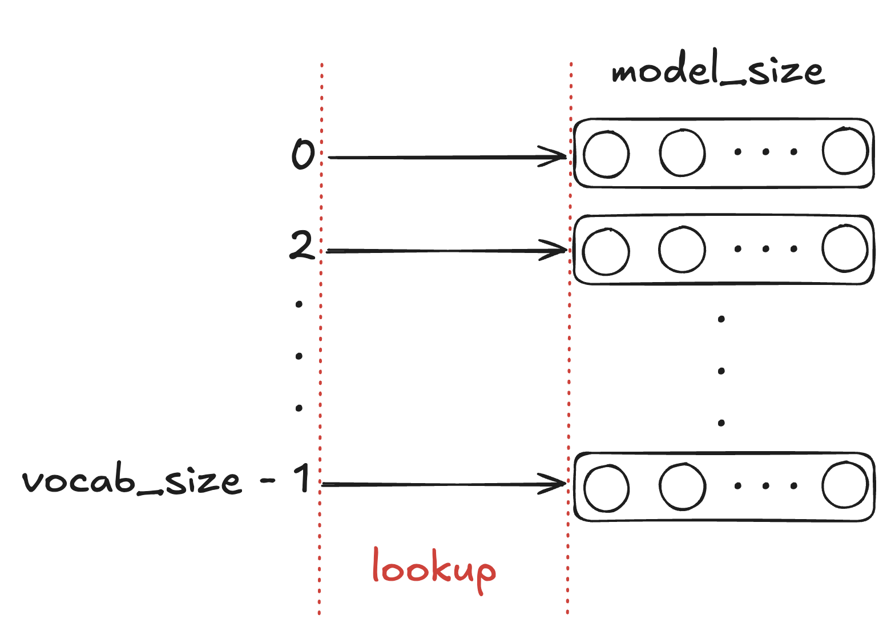

## Positional Encoding

使用经典的正弦余弦位置编码：

- pos表示token在序列中的索引
- d~model~表示一个token的特征维度大小
- i表示特征维度的索引

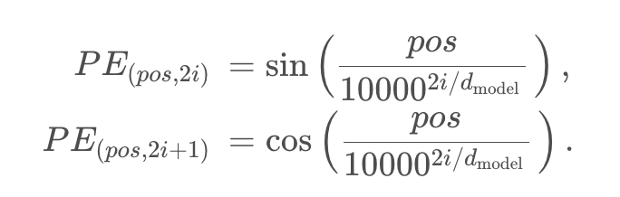

注意力机制在对于一个查询考虑使用每一个键值对的权重的时候，本身是不会用到键值对的位置关系的

键值对本质上是集合，是无序的

然而如果键值对是一个序列的话，这样直接应用注意力机制会导致序列丢失原本的位置信息

使用正弦余弦位置编码的好处在于既为键值对添加了用来表示位置信息的编码

又由于三角函数本身的周期性，让这样的位置编码有了相对位置信息（不同token之间的距离）

## Output

最终的解码器输出的特征维度其实还是Embedding的维度大小

需要通过线性映射到词表大小的维度得到对应的词表中每一个token的未归一化分数（logit）

最后通过一层softmax层得到归一化的概率（probability）

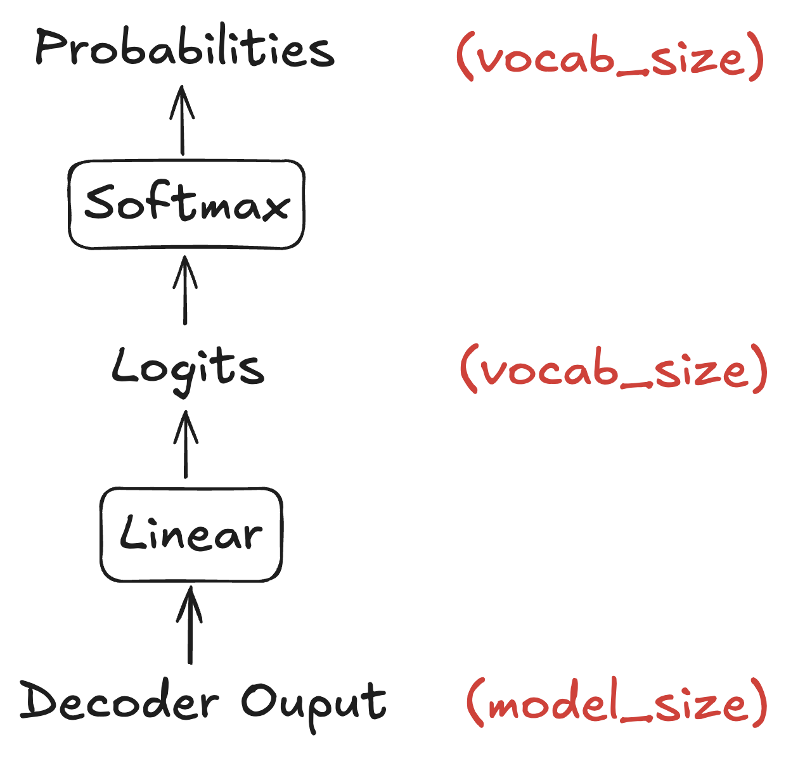

## Transformer

对上面的子模块进行组装可以得到最终的Transformer架构

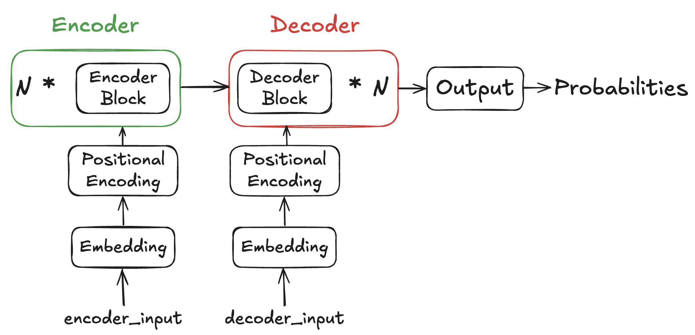

# Method

## Tokenize

对语言文本构建词表时，使用的是Byte Pair Encode（BPE）

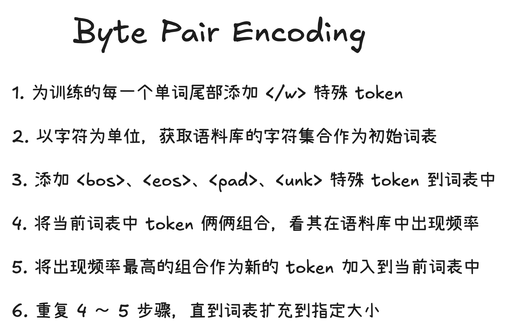

BPE的好处：

- 有效缩小词表大小，词表大小可控
- 几乎不会出现Out-of-Vocabulary（OOV）问题，但是为了应对测试集可能出现的特殊字符，需要在词表中添加 \<unk> token
- 可以拆分子词的语义（对英语非常适用），有更强的泛化能力

## Data Processing

### Encoder Input

在编码器输入的文本序列基础上，加上一个标识着序列结束的token

能够让解码器在翻译的过程中学习到翻译的结束


### Decoder Input

在解码器的输入文本序列的基础上，加上一个标识着序列起始的token

让解码器知道要翻译第一个token了（解码器是根据前面token的信息翻译后面一个token的）

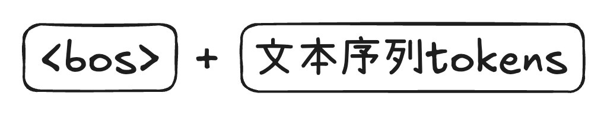

### Label

对应标签数据，对one-hot表达形式进行一个平滑化处理

这样做模型的输出不会过度的自信，输出的概率更加平滑，翻译的结果会更准确

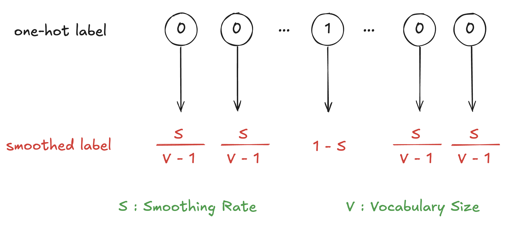

## Loss Function

损失函数使用交叉熵损失，在计算的时候是以token为单位的，一个token对应一个交叉熵损失

使用模型预测的probabilities与平滑化的标签来计算

最终得到整个批次的每一个token的平均交叉熵损失

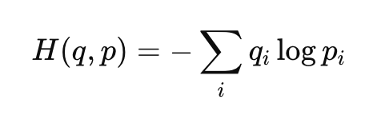

其中：

- p~i~表示模型预测的概率分布
- q~i~表示真实标签的概率分布

## Optimizer

优化器选用Adam优化器：

- 采用动量机制，解决梯度震荡问题，让参数更新更加平滑，加速模型收敛

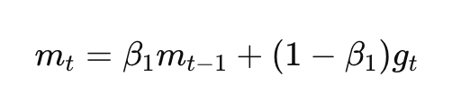

- 通过自适应的梯度缩放，梯度变化大的参数变化步长缩小

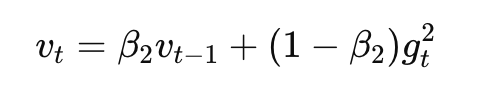

- 最后通过偏差修正，解决训练前几步趋于0的问题

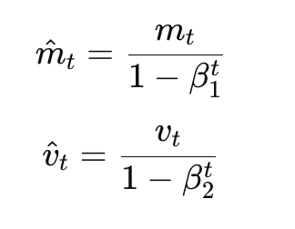

最后参数更新公式如下：

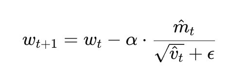

## Learning Rate Warmup

在模型训练初期，学习率不宜太大，因为这个时候模型训练还不稳定

通过预热机制让学习率在指定的优化次数中逐渐的升高到预设的目标学习率，可以让模型训练更稳定

在预热优化步数之后，再进行学习率的衰减，在模型训练的后期可以提高收敛精度

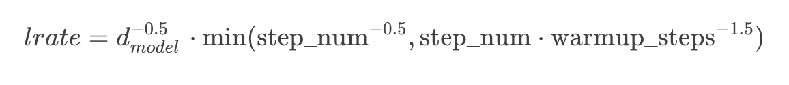


## Mask

### Padding Mask

在Transformer的注意力机制中，键值对都是序列

当序列存在填充token时，这个token就是无效的键值对，在计算查询对应的输出时不应该使用这个无效的键值对

做法就是对于正常输出的注意力分数中，使用到填充token作为键值对的部分设置为无穷小

这样在经过softmax层时，这个位置对应的注意力权重就为0（表示在输出结果的过程中没有使用到这个无效键值对）

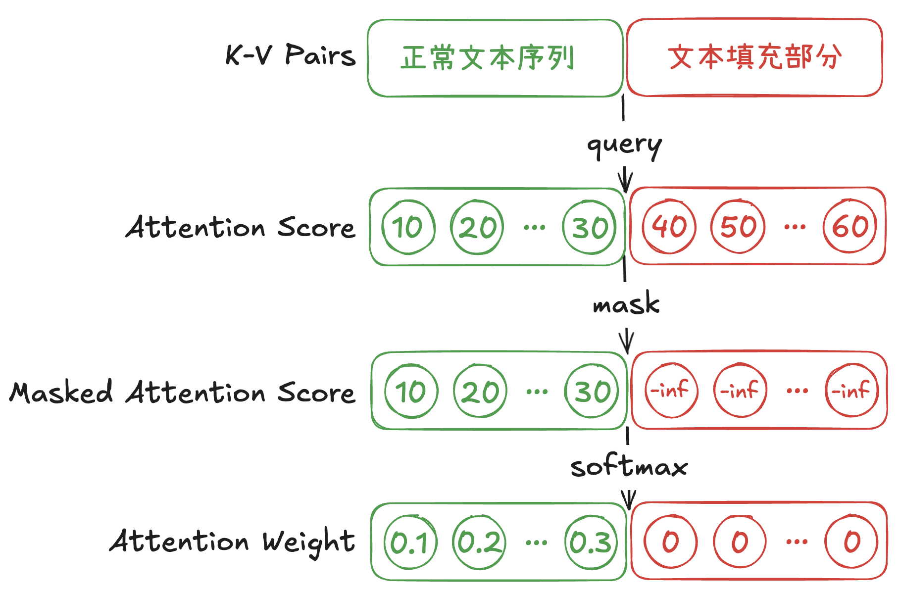

padding mask主要应用在编码器的自注意力、解码器的交叉注意力中，屏蔽编码器输入序列中填充项的干扰

同时也应用于损失函数的计算中，不对填充token计算损失值

### Causal Mask

在实际预测翻译过程中，我们在输出下一个预测token时是无法看到真实的这个token以及其后面的token的

也就是说解码器在自注意力部分提取序列特征时，每一个token只能使用它本身及其之前的token信息进行融合

换成自注意力的说法就是，当使用某个token作为查询时，能使用的键值对只有它本身和其之前的token

causal mask就是用于屏蔽未来token对查询的影响的


# Training Process

训练过程主要有以下两个部分：

- 正向传播，计算交叉熵损失

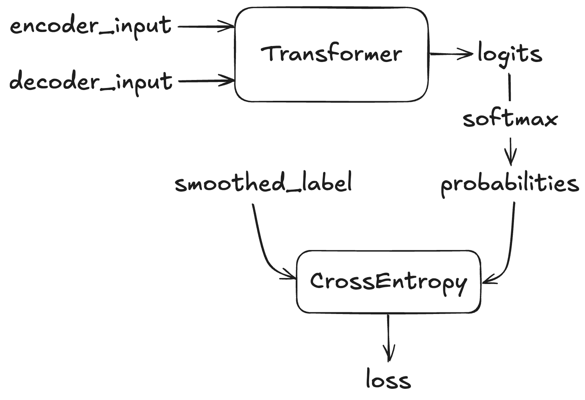

- 反向传播，更新模型参数

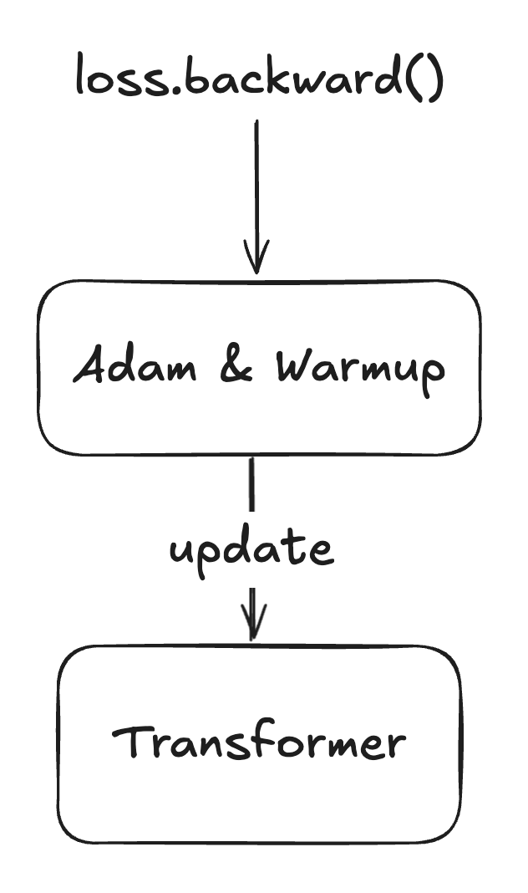

# Testing Process

测试流程是没有反向传播更新模型的流程的

相比训练流程，测试流程的编码器输入输出部分是完全一致的

测试时解码器是没有文本输入的，初始输入只有一个标识起始的token，让编码器去预测下一个token

然后将下一个token合并到当前的解码器输入中再次输入

重复上述的两个步骤，直到编码器输出的预测token为标识结束的token，或者预测序列到达指定的最大长度

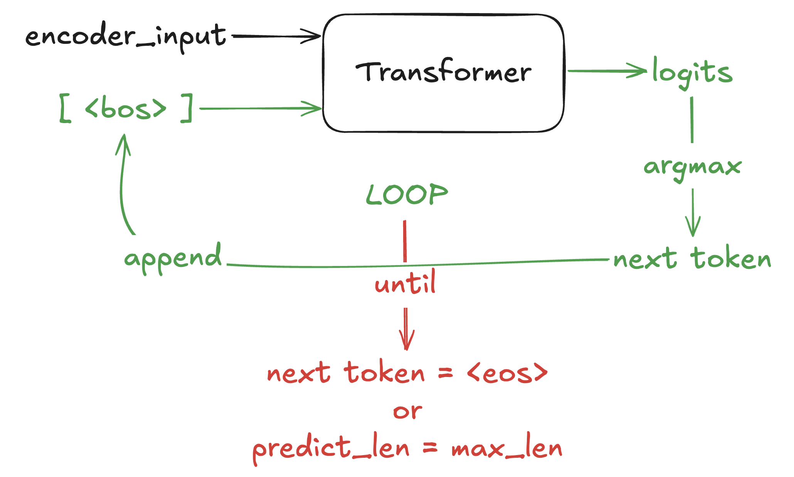

# Evaluation

在对模型进行评估时，使用模型在整个测试集上的预测翻译序列于参考翻译序列之间的BLEU-4分数来衡量

- n-gram精度，用于衡量机器翻译序列中n-gram在参考序列中的出现率

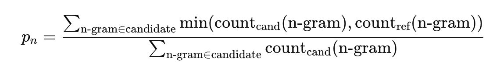

- 长度惩罚，对机器翻译结果较短的句子进行惩罚

c表示机器翻译序列长度，r表示参考序列长度

当机器翻译长度比参考序列长度长时，不进行惩罚

当机器翻译长度比参考序列长度短时，减少BLEU分数

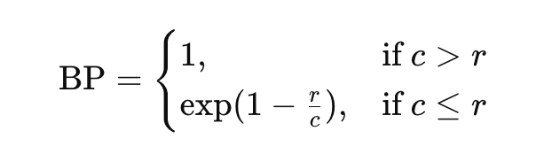

- BLEU分数，综合n-gram精度来衡量模型翻译效果，分数越高、模型效果越好

N表示n-gram的最大级别，我在这里使用的是4，也就是BLEU-4分数

BP表示长度惩罚

P~n~表示n-gram精度

w~n~表示对不同级别n-gram精度对考量权重，我这里使用的是无差别考量（1/N）

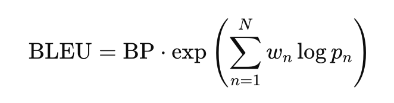

# Result

## Parameters

大部分参数依照论文中所提到的进行复现

```yaml
train_sample_size: 4508785
batch_size: 256
num_epochs: 30
# 17612 step / epoch

vocab_size: 37000
num_encoder_blocks: 6
num_decoder_blocks: 6
dropout: 0.1
smoothing_rate: 0.1 
model_size: 512
ffn_size: 2048
num_heads: 8
max_len: 50
warmup_step: 4000
learning_rate: 0.0001
beta1: 0.9
beta2: 0.98
eps: 0.000000001
```

## Loss Curve

可以注意到我的损失值是每一个epoch记录一次，表示这次epoch中损失值的总和，方便观察损失值变化趋势

从图中可以观察到损失值的下降是一个逐渐变慢的过程

这是由于在学习率调度的后期会进行学习率的衰减，可以提高模型的收敛精度

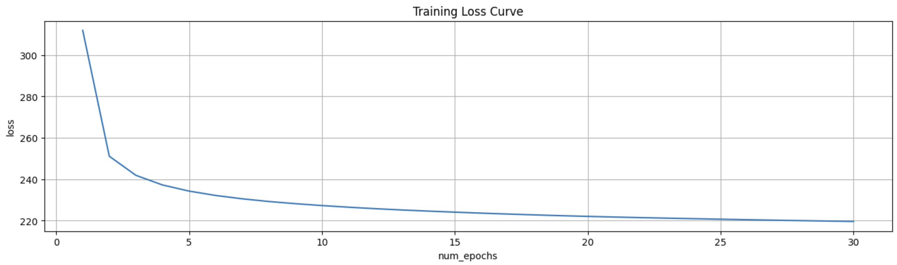

## BLEU

训练不同时长的模型在测试集上的表现：

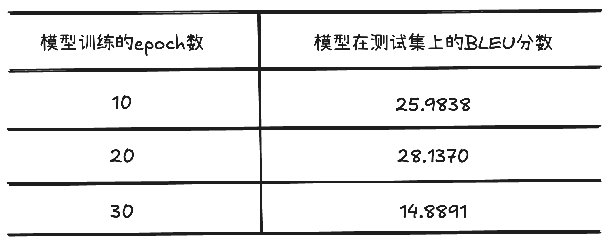

可以看到从第20个epoch往后面进行训练时，会出现模型过拟合现象，导致模型在测试集上的表现变差

同时这个跑20个epoch的模型是达到了论文中给出的效果的（我复现的是base model版本）

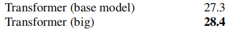

